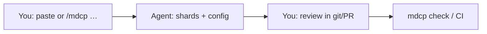
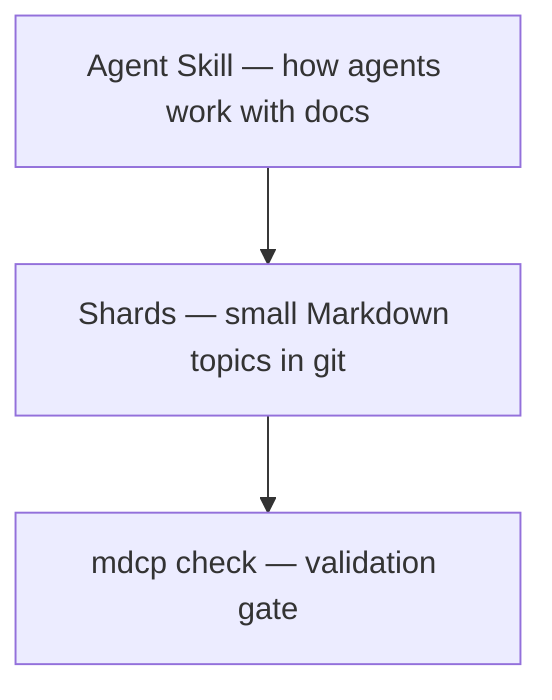

<!-- AUTO-GENERATED by mdcp — edit shards, then run: mdcp compile -->

# MDCP — documentation system Agent Skill

<!-- mdcp-shard: start docs/repo-readme/what-this-tool-is.md -->

## What this tool is

[](https://skills.sh/betsalel-williamson/mdcp)

**mdcp** is a **documentation system** delivered as an [Agent Skill](https://agentskills.io) plus a small compile/check toolchain. It is for people who know good docs compound — and that unvalidated monolith READMEs get expensive as product ideas keep arriving.

Instead of dumping every mind map, architecture note, and spec into one file that overwhelms both humans and LLM context windows, MDCP keeps that intent in small, validated Markdown **shards** — for example `docs/features/my-feature.md`, `docs/procedures/line-changeover.md`, `docs/equipment/press-manual.md`, or `docs/training/onboarding-module.md`. Agents learn to read **one shard at a time**, update shards before changing the system (software, procedures, or training), and run checks in CI — so documentation stays findable and trustworthy as the system grows. Discover and install via [skills.sh](https://skills.sh/betsalel-williamson/mdcp).

<!-- mdcp-shard: end docs/repo-readme/what-this-tool-is.md -->

<!-- mdcp-shard: start docs/repo-readme/get-started.md -->

## Get started

Install MDCP when you want a **documentation system** your agents will actually follow — sharded Markdown, compile/check in CI, and less effort keeping docs honest as ideas arrive. Use the [`skills` CLI](https://www.skills.sh/docs/cli) (same path as [skills.sh](https://skills.sh)).

### Quick Start

Install the core documentation-system Agent Skill into your repository:

```bash
npx skills add betsalel-williamson/mdcp --skill mdcp
```

_(This copies the skill into your agent's skills directory (chosen by the [`skills` CLI](https://www.skills.sh/docs/cli) via `--agent` or auto-detect). Commit it to git so every teammate and agent shares the same documentation discipline. Per-agent paths: [Supported Agents](https://github.com/vercel-labs/skills#supported-agents).)_

Then start a bootstrap session:

```text
/mdcp help me get started
```

The agent asks for `FEATURE` and `PERSONA`, then helps wire config, guide layout, and validation. After bootstrap, it can walk an optional **first feature** through design → feature → UX → doc-only (recommended example or your own). Once the pipeline exists, agents proactively look up shard context, compile documentation, and validate references before changing the system or implementing.

<!-- mdcp-shard: end docs/repo-readme/get-started.md -->

<!-- mdcp-shard: start docs/repo-readme/about.md -->

## Why use MDCP?

- **Built for documentation-system thinkers:** Puts durable intent (specs, design notes, glossaries) in the repo where it compounds — not only in chat history or slide decks.
- **Lower maintenance as ideas keep coming:** One topic per shard means new features extend the docs tree instead of bloating a monolith you no longer trust.
- **Docs-as-code for agents:** Agents update shards before implementing, so “what we meant” stays reviewable in git (the V1 transport) alongside the change.
- **Smaller, safer context loads:** People and LLMs read the section that matches the task — not the whole guide every turn.
- **Validation gate:** `mdcp check` keeps cross-links and refs trustworthy in CI when the docs system grows.
- **Portable skill:** Works in Cursor, GitHub Copilot, Claude Code, and other hosts that support [Agent Skills](https://agentskills.io).

<!-- mdcp-shard: end docs/repo-readme/about.md -->

<!-- mdcp-shard: start docs/repo-readme/mdcp-101.md -->

## MDCP 101

[MDCP](docs/glossary/mdcp.md) is a **human + AI documentation habit** for technical work: you and your agent keep durable intent in small Markdown files in git, instead of only in chat history.

### The problem

Agents forget. Chat threads disappear. Giant READMEs and dump files overwhelm both humans and model context. Next week's session cannot reliably reuse yesterday's decisions.

### How you work together

1. **You** decide what must stay true (product intent, constraints, glossary).
2. **The agent** drafts or updates small **[shards](docs/glossary/shard.md)** (one topic per file) _before_ coding.
3. **You** review those shards in pull requests (PRs) — you do not need to be a Markdown expert on day one.
4. **`mdcp check`** (locally or in CI) proves links and compile still work.

#### Prompt loop



**In an [Agent Skills](https://agentskills.io) host** (Cursor, Claude Code, Copilot with skills, and similar):

```text
/mdcp help me get started
```

Or paste that line after installing the skill (`npx skills add betsalel-williamson/mdcp --skill mdcp` via the [`skills` CLI](https://www.skills.sh/docs/cli) — see [Get started](#get-started)).

**In a chat-only tool** (ChatGPT, Gemini web, no repo agent): do **not** install the toolchain yet. Keep notes in your project folder if you have one, or wait until you use an agent that can [edit a git repo](https://github.com/git-guides). Read [Overview](docs/features/overview.md) and [Vision and roadmap](docs/features/protocol/00-vision-and-roadmap.md) first.

**Automation / CI:** the [Agent Skill](docs/features/agent-skill.md) tells agents _when_ to touch docs; the [CLI](docs/client-cli/index.md) runs `compile` / `check` in scripts and pipelines ([The Toolchain](#the-toolchain)).

### Are you ready?

| Scenario                                          | Ready?    |
| ------------------------------------------------- | --------- |
| Git repo + an agent that can edit files           | Start now |
| Docs or decisions already sprawling (or about to) | Start now |
| Willing to review doc changes, not only code      | Start now |
| Chat-only coding with no project folder           | Wait      |
| One-off toy you will not reopen                   | Wait      |
| No interest in durable docs beyond chat           | Wait      |

You feel the benefit on the **second session** — when prior decisions are still findable — not on the first install.

### What's in the box



- **[Skill](https://agentskills.io)** ([MDCP sense](docs/glossary/skill.md)) — instructions your agent follows (`/mdcp`, helpers).
- **[Shards](docs/glossary/shard.md)** — source of truth; compiled READMEs are generated — do not hand-edit them.
- **[Check](docs/glossary/check.md)** — keeps the docs system honest as it grows.

Deeper model: [Overview](docs/features/overview.md). Install path: [Get started](#get-started).

<!-- mdcp-shard: end docs/repo-readme/mdcp-101.md -->

<!-- mdcp-shard: start docs/repo-readme/the-toolchain.md -->

## The Toolchain

MDCP has **three separate surfaces**. Each has its own docs — do not treat them as one install or one README.

- **Agent Skill** — `npx skills add … --skill mdcp`. How agents maintain shards (`/mdcp`, subagents). Docs: **this README**.
- **CLI** — `npm i -D @bwilliamson/mdcp-cli`. Shell commands only. Docs: [`@bwilliamson/mdcp-cli`](./packages/mdcp-cli/README.md).
- **Core** — `npm i @bwilliamson/mdcp-core`. Programmatic API only. Docs: [`@bwilliamson/mdcp-core`](./packages/mdcp-core/README.md).

The skill tells agents _when_ and _how_ to use documentation; the CLI and core **execute** compile and validation. Agents still need `@bwilliamson/mdcp-cli` (or equivalent scripts) in the repo for those commands to run.

<!-- mdcp-shard: end docs/repo-readme/the-toolchain.md -->

<!-- mdcp-shard: start docs/repo-readme/learn-more.md -->

## Learn More

- [Overview — how MDCP fits together](docs/features/overview.md)
- [skills.sh — MDCP skills](https://skills.sh/betsalel-williamson/mdcp)
- [Vision and roadmap](docs/features/protocol/00-vision-and-roadmap.md)
- [Agent Skill](docs/features/agent-skill.md)
- [Agent Skill development](docs/developer/agent-skill.md)
- [CLI consumer guide](docs/client-cli/index.md) — `@bwilliamson/mdcp-cli` (not the skill)
- [Core API guide](docs/client-core/index.md) — `@bwilliamson/mdcp-core`

<!-- mdcp-shard: end docs/repo-readme/learn-more.md -->

<!-- mdcp-shard: start docs/repo-readme/this-repository.md -->

## This repository

Contributors and maintainers working on the **mdcp monorepo** — not consumers adopting mdcp in another repo.

```bash
pnpm install && pnpm build
pnpm docs:check
```

Full guide: [DEVELOPERS.md](DEVELOPERS.md). Sharded docs layout: [Docs dogfooding](docs/developer/docs-dogfooding.md). Publish landing style: [Personas and priority tiers](docs/features/personas-and-priority-tiers.md#publish-landing-style).

This project follows the [Contributor Covenant Code of Conduct](CODE_OF_CONDUCT.md).

### Status

**Pre-1.0:** There is **no API stability guarantee** until npm 1.0.

**Get involved:** [GitHub Issues](https://github.com/betsalel-williamson/mdcp/issues) for feedback and bugs; [adoption stories](https://github.com/betsalel-williamson/mdcp/issues/new?template=adoption-story.yml) for real-world use.

### Acknowledgments

- [Denali Lumma (@dlumma)](https://github.com/dlumma) — early review and feedback

### License

MIT

<!-- mdcp-shard: end docs/repo-readme/this-repository.md -->
