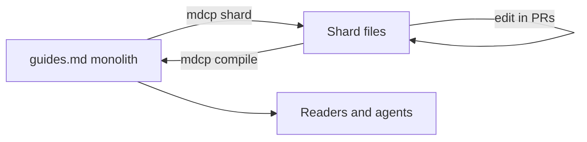

# MDCP — Markdown Command Line Interface Processor

**mdcp** splits, compiles, validates, and exports sharded Markdown documentation for code repositories. It uses the same Markdown you already know from READMEs and GitHub — `#` headings, `[links](url)`, lists, and tables. Nothing extra to memorize.

You edit small shard files. mdcp **weaves** them back into one compiled file (`guides.md`) with correct heading levels, working cross-links, and structure checks.

mdcp is **opinionated**. The weave step is not a naive merge — compile applies Markdown formatting rules (heading levels, preamble handling, single document title, and more). Shards can look different from the compiled monolith on purpose; that is how the tool keeps output consistent.

## You probably started with one file

Most projects begin with a single `guides.md` (or similar). That works until the doc grows.

| Pain point             | What goes wrong                                                                    |
| ---------------------- | ---------------------------------------------------------------------------------- |
| **LLM editing**        | Whole-file rewrites, broken cross-links, context windows too small                 |
| **Human review**       | Giant PR diffs — hard to see what actually changed                                 |
| **Readers and agents** | People and coding agents still want one compiled guide for reading or feature work |

The fix is not to abandon the monolith entirely. The fix is to **stop editing it by hand**.



**Shards are the source of truth.** The compiled monolith is generated output.

## What is a shard?

A **shard** is one Markdown file that holds a section of a guide — typically one chapter or topic. Shards live in **guide directories** under a shared root.

See [examples/sample-guides/](examples/sample-guides/) for a working layout:

| Piece                                         | Role                                                   |
| --------------------------------------------- | ------------------------------------------------------ |
| Guide directory (`overview/`, `admin-guide/`) | One logical guide                                      |
| `index.md`                                    | Human table of contents — links to shard files         |
| `sections.txt`                                | Machine compile order (regenerated by `mdcp sections`) |
| `chapter-*.md`                                | One topic or chapter per file                          |
| `about-this-guide.md`                         | Optional preamble shard (special compile rules)        |

### Heading demotion is intentional

Shards and the compiled monolith use different heading levels on purpose. Each shard starts with `#` so it reads well on its own. When mdcp compiles, those headings demote under the guide title.

**Shard** ([overview/introduction.md](examples/sample-guides/overview/introduction.md)):

```markdown
# Introduction

Welcome to the sample documentation set.
```

**Compiled output** ([guides.md](examples/sample-guides/guides.md)):

```markdown
# Documentation Overview

## Introduction

Welcome to the sample documentation set.
```

You cannot get this by concatenating files. That is one reason mdcp exists.

During weave, mdcp also enforces structural rules on the compiled monolith — for example, one top-level `#` title for the whole document, with later guides demoted under it. Optional linters in `mdcp check` (markdownlint, Vale) add further formatting expectations on shards and compiled output. See `@bwilliamson/mdcp-presets` and your `mdcp.config.json` `lint` section to tune what runs in your repo.

## Why you need a utility (not just split the file)

Splitting a monolith into separate files is easy. Keeping a **correct** compiled monolith is hard.

| Manual split fails on                                                    | mdcp handles it                                                                               |
| ------------------------------------------------------------------------ | --------------------------------------------------------------------------------------------- |
| Each shard has `#` but compiled doc needs nested `##` under guide titles | Heading demotion during compile                                                               |
| Preamble / "about this guide" should not duplicate H1 in output          | `about-this-guide` stripping                                                                  |
| TOC order vs filename sort order                                         | `index.md` + `sections.txt` manifest                                                          |
| Cross-chapter links (`See Chapter 3`, bare `Ch. N`)                      | Xref lint in `mdcp check`                                                                     |
| Links to other sections (`[text](#some-section)`) break after recompile  | `refs.json` — a lookup table of section links, built automatically from compiled headings     |
| Stray `.md` files nobody linked                                          | Orphan check in `mdcp check`                                                                  |
| Diagrams or evidence blocks that should expand at compile time           | **Compile hooks** — extension points for consumer-specific transforms (e.g. `inlineDiagrams`) |

mdcp uses `@kayvan/markdown-tree-parser` for **split only**. Compile logic is custom because generic assemblers do not apply these rules. See [docs/design.md](docs/design.md) for technical details.

### Cross-links without memorizing anchor names

When you link to another section, you write something like `[Admin setup](#admin-chapter-1-getting-started)`. The part after `#` must match how the compiled doc names that heading — which changes when shards are merged and headings shift level.

Instead of guessing, ask mdcp:

```bash
mdcp refs lookup "getting started" --format json
```

That searches the compiled heading list and returns the link target to paste into your shard.

## Why plain Markdown?

If you have used Pandoc, MkDocs, Docusaurus, Sphinx, or similar tools, you may wonder why mdcp stays on **plain GitHub-flavored Markdown** instead of richer syntax — custom heading IDs (`{#my-anchor}`), wikilinks, includes, LaTeX, and so on.

| We skip extended syntax because                                       | What mdcp does instead                                                                                                                             |
| --------------------------------------------------------------------- | -------------------------------------------------------------------------------------------------------------------------------------------------- |
| **LLM authors** edit more reliably when docs look like normal READMEs | Shards use ordinary `#` headings and `[links](url)`                                                                                                |
| **Reviewers** should read diffs, not preprocessor directives          | No magic comments or vendor-specific extensions in source files                                                                                    |
| **Link targets** should follow what readers actually see              | Section links are derived from compiled headings (same rules GitHub uses when rendering), not hand-maintained IDs that drift                       |
| **Linting** should run on what you commit                             | Optional markdownlint and Vale run directly on shard files — no conversion step                                                                    |
| **Scope** is split → compile → validate, not publish                  | Need PDF, a doc site, or diagrams? Use your existing toolchain on the compiled `guides.md`, or add a **compile hook** for repo-specific transforms |

mdcp is deliberately narrow: make large docs editable in small pieces, then produce one trustworthy compiled file. It is not a replacement for Pandoc or a static site generator.

## How mdcp fits your workflow

| Persona                     | Daily commands                                                |
| --------------------------- | ------------------------------------------------------------- |
| **Writing docs**            | Edit shards → `mdcp sections` (if TOC changed) → `mdcp check` |
| **Coding with doc context** | `mdcp export --llm --stdout`                                  |
| **Reviewing a PR**          | `mdcp check --require-lint`                                   |

## Quick start

### Try the example (clone this repo)

```bash
pnpm install && pnpm build
node packages/mdcp-cli/dist/cli.js compile --config examples/sample-guides/mdcp.config.json --cwd examples/sample-guides
node packages/mdcp-cli/dist/cli.js check --config examples/sample-guides/mdcp.config.json --cwd examples/sample-guides
```

Open `examples/sample-guides/guides.md` to see compiled output from the shards.

### Add to your repo

After publish:

```bash
npx @bwilliamson/mdcp-cli check --config mdcp.config.json
```

Copy [examples/sample-guides/mdcp.config.json](examples/sample-guides/mdcp.config.json) as a starting point. Key fields:

| Field               | Purpose                                                          |
| ------------------- | ---------------------------------------------------------------- |
| `compileOrder`      | Order of guide directories in the compiled monolith              |
| `guides`            | Per-guide compile options (hooks, manifests, outputs)            |
| `outputFile`        | Compiled monolith path (e.g. `guides.md`)                        |
| `refs.registryFile` | Cross-link lookup table (`refs.json`) built during check/compile |

### Migrate from a monolith

Add `source` to your config pointing at your existing monolith, then:

```bash
mdcp shard
mdcp sections
mdcp compile
mdcp check
```

Full migration steps: [docs/PHASE2-MIGRATION.md](docs/PHASE2-MIGRATION.md).

## Agent integration

Add npm scripts in your consumer repo:

```json
{
  "scripts": {
    "docs:context": "mdcp export --llm --stdout --config docs/mdcp.config.json",
    "docs:refs": "mdcp refs lookup",
    "docs:check:mdcp": "mdcp check --config docs/mdcp.config.json --require-lint"
  }
}
```

```bash
# Compact context for feature work
mdcp export --llm --stdout --config docs/mdcp.config.json

# Find the right section link while writing
mdcp refs lookup "authentication" --format json

# Full structural gate
mdcp check --require-lint
```

## Commands

| Command                    | When you need it                                                     |
| -------------------------- | -------------------------------------------------------------------- |
| `mdcp compile`             | Regenerate the monolith from shards                                  |
| `mdcp check`               | Full gate: orphans → compile → refs → xrefs; optional peer linters   |
| `mdcp shard`               | Split a monolith into shards (requires `config.source`)              |
| `mdcp sections`            | Regenerate `sections.txt` after changing a guide's `index.md`        |
| `mdcp refs list`           | List all section link targets from the compiled doc as JSON          |
| `mdcp refs lookup <query>` | Search section titles while writing cross-links                      |
| `mdcp export --llm`        | Token-stripped compiled output for LLM context                       |
| `mdcp lint`                | markdownlint-cli2 on shards and compiled output (peer, if installed) |
| `mdcp prose`               | Vale prose lint (peer, if installed)                                 |
| `mdcp fix`                 | Prettier + markdownlint --fix (peer, if installed)                   |

See [docs/FEATURES.md](docs/FEATURES.md) for the full feature catalog.

## Contributing to mdcp

```
mdcp/
├── packages/
│   ├── mdcp-core/          # @bwilliamson/mdcp-core — library
│   ├── mdcp-cli/           # @bwilliamson/mdcp-cli — npx binary
│   └── mdcp-presets/       # @bwilliamson/mdcp-presets — starter lint configs
├── examples/
│   └── sample-guides/      # Minimal sharded docs fixture
├── legacy/                 # Original bash/Python reference
└── docs/
```

```bash
pnpm install
pnpm build
pnpm vale:sync          # once — fetches Vale styles for examples/sample-guides
pnpm run check          # typecheck, eslint, prettier, build, test, docs:check
pnpm run lint:fix
pnpm run format
brew install gitleaks   # optional locally; CI always scans
```

This repo installs `markdownlint-cli2` and `@vvago/vale` as **devDependencies** for dogfooding. Published `@bwilliamson/mdcp-cli` treats them as optional peers in consumer repos.

Further reading:

- [docs/FEATURES.md](docs/FEATURES.md) — feature catalog by persona and priority
- [docs/design.md](docs/design.md) — design constraints and md-tree integration
- [docs/PHASE2-MIGRATION.md](docs/PHASE2-MIGRATION.md) — migration from monolith or legacy scripts
- [docs/VERSIONING.md](docs/VERSIONING.md) — semver policy and release schedule
- [PUBLISH.md](PUBLISH.md) — npm publish workflow

### Releasing a change

If your PR touches `packages/mdcp-*` source or published configs, add a changeset before merge:

```bash
pnpm changeset
pnpm changeset:status   # optional — verify before pushing
```

Maintainers release to npm from `main` with `pnpm release:tag:push` (interactive: patch/minor/major/build + typed confirmation → CI publishes). See [docs/VERSIONING.md](docs/VERSIONING.md).

## License

MIT
