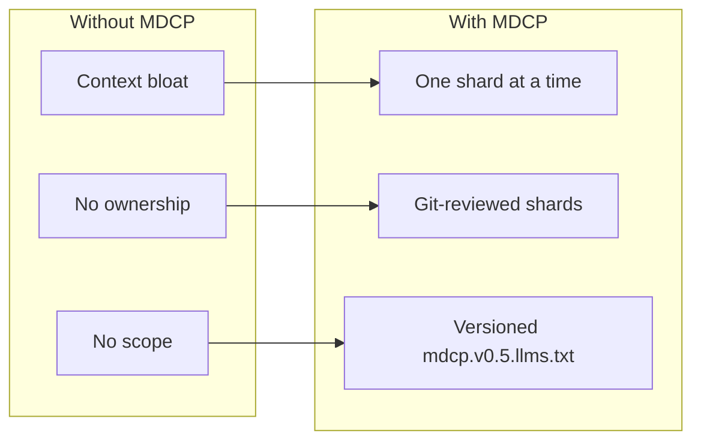
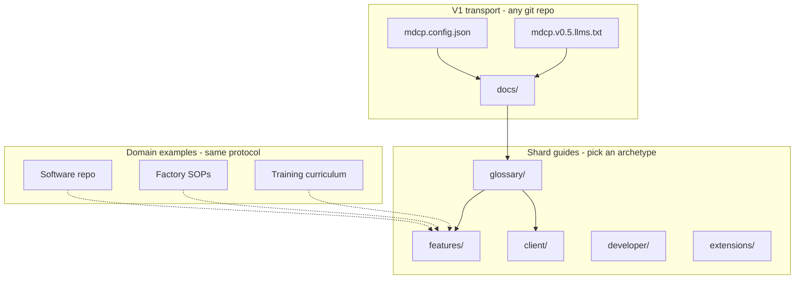
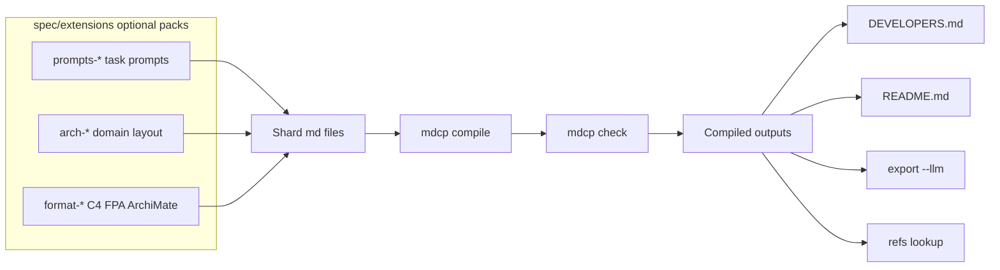
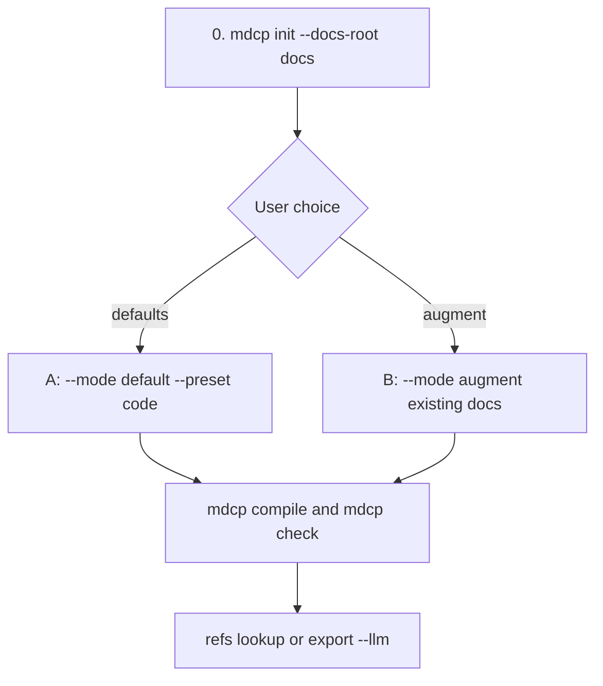

# MDCP — MarkDown Context Protocol

**mdcp** is an open protocol for **technical documentation context** — sharded intent and design in Markdown, validated compile output for agents, CI, and human readers. Software repositories are the most common adoption path, but the same shard model applies to factory procedures, equipment manuals, training curricula, and other durable technical knowledge. V1 stores shards in a **git repo**; the content domain is separate from the transport.

You edit small shard files; mdcp weaves them into compiled output with correct heading levels, working cross-links, and structure checks. The CLI is one surface for `compile`, `check`, `refs lookup`, and `export --llm`.

## Why MDCP

LLM pair-coding on a real repo breaks down when documentation is a single monolith, unvalidated, and tangled up with implementation. Merge conflicts stack up on one giant README. Agents guess `#anchor` slugs that rot after the next edit. Every turn dumps the whole guide into context. Shards and published output drift apart silently. A one-off bash script holds it together until nobody owns it.

**The usual fixes do not solve that:**

| Approach                            | What it misses                                                                                   |
| ----------------------------------- | ------------------------------------------------------------------------------------------------ |
| Monolithic README / full `llms.txt` | No sharding, no validation gate, no stable refs registry                                         |
| Context7 / large crawled corpora    | Fuzzy retrieval — not author-controlled, deterministic, or PR-reviewable                         |
| Cursor rules / `AGENTS.md`          | Host-native friction hints, not validated product context in git                                 |
| Docusaurus / MkDocs / VitePress     | Strong public doc sites — weak agent-first `refs lookup`, scoped export, and CI structural gates |
| MCP filesystem reads                | Delivers whatever exists; does not enforce shard discipline at authoring time                    |

MDCP is complementary to MCP and doc-site generators: it owns **authoring, compile invariants, and the validation gate** upstream of delivery. See [Scope and positioning](docs/features/protocol/01-scope-and-positioning.md).

## MDCP 101

MDCP replaces monolithic `llms.txt` dumps with a short versioned index (`mdcp.v*.llms.txt`) plus on-demand shards. Three problems, three fixes:



The same protocol works for software repos, operations docs, and training material — pick an archetype, keep shards under `docs/`:



Optional extension packs (`prompts-*`, `arch-*`, `format-*`) feed the compile pipeline:



**For agents — start here** (protocol 0.5):

```bash
npx @bwilliamson/mdcp-cli init --docs-root docs
```

Ask the user: **defaults** (standard scaffold) or **augment** (map MDCP onto existing docs without deleting content)? Then compile, check, and query one shard at a time.



Details: [Install and quick start](docs/client-cli/install-and-quick-start.md). Open alpha (0.4.x) consumers still use [getting-started-with-mdcp.prompt.md](spec/extensions/prompts-mdcp-defaults/0.4.0.0/getting-started-with-mdcp.prompt.md) until npm 0.5 ships `mdcp init`.

**What MDCP does not replace:** MDCP is a **middle layer** in your stack — not a substitute for what sits above or below it:

- **Ephemeral work docs** — sprint plans, task briefs, spike notes, and scratch docs that help turn meta ideas into code. Those stay temporary and task-scoped; mdcp shards hold **durable product context** that outlives a single PR or agent session.
- **Orchestrators and agent systems** — Cursor rules, MCP servers, CI pipelines, and multi-agent coordinators still run your workflow. MDCP feeds them validated, scoped documentation context; it does not replace how they schedule, route, or hand off work.
- **Checked-in prompts and playbooks** — many teams already version agent prompts, rules files, and workflow templates in git. MDCP complements that habit with a formal, open framework: validated product-context shards, compile/check gates, `refs lookup`, and versioned task prompts — so prompt libraries and durable documentation share the same discipline.
- **Implementation** — code, tests, and config remain the source of truth for behavior. Shards carry intent, constraints, and acceptance criteria — not line-by-line instructions that duplicate the repo.

The goal is to **reduce friction between** durable context and active work: smaller documentation batches, fewer context-switching interruptions, and less time re-explaining the system each turn — so humans and agents stay closer to flow state.

**Adopt it today** — the open-alpha CLI (0.4.0) is a working foundation, not a slide deck:

- **Ship faster with agents** — `mdcp refs lookup` resolves link targets from compiled output; `mdcp export --llm` scopes context to what the next turn needs instead of re-sending the entire README.
- **Stop doc drift before merge** — `mdcp check` runs the same compile → refs → xrefs pipeline for agents, CI, and human reviewers.
- **Edit docs like code** — small shards, manifest order, one compile step; publish to monolith, `DEVELOPERS.md`, or npm READMEs from the same source.
- **Keep plan separate from implementation** — shards hold context and the high-level plan; code holds how. Structure enforces that split.

Task prompts and a bootstrap index get you started in a consumer repo without inventing workflow from scratch: [Why mdcp for coding agents](docs/client-cli/why-mdcp-for-agents.md), [LLM collaboration](docs/client-cli/llm-collaboration.md), [Alternatives and adoption](docs/features/protocol/02-alternatives-and-adoption.md).

**So what — how do I use this in my project?** Install [`@bwilliamson/mdcp-cli`](https://www.npmjs.com/package/@bwilliamson/mdcp-cli) in **any** repository — monorepo or single app, any language or stack. mdcp cares about your documentation shards and compile pipeline, not your application architecture.

```bash
npm install -D @bwilliamson/mdcp-cli
```

Copy [getting-started-with-mdcp.prompt.md](spec/extensions/prompts-mdcp-defaults/0.4.0.0/getting-started-with-mdcp.prompt.md), fill in `FEATURE=` and `PERSONA=`, and send it to your coding agent — it walks through config, shard layout, and first `mdcp check`. Or fetch prompts with `npx @bwilliamson/mdcp-cli export --llms-index --fetch --fetch-profile alpha --fetch-ref v0.4.1 --docs-root docs`. Details: [Install and quick start](docs/client-cli/install-and-quick-start.md).

**Where it is going:** Like [OpenAPI](https://www.openapis.org/) standardized HTTP API contracts, MDCP is evolving into an open contract for **documentation context** — intent, design, and terminology you can share with other systems. That benefits inter-agent development (validated shards and glossaries instead of re-crawling ad hoc prose) and human-in-the-loop verification: reviewers read the same compiled context agents use and confirm the system behaves as documented. Roadmap: [Vision and roadmap](docs/features/protocol/00-vision-and-roadmap.md).

> **Open alpha (0.4.x).** MDCP is moving fast — this release is a working foundation for early adopters. Tooling and the draft protocol profile may change in 0.5+. Pin `@bwilliamson/mdcp-cli@0.4.1`. Fetch the agent bootstrap with `npx @bwilliamson/mdcp-cli export --llms-index --fetch --fetch-profile alpha --fetch-ref v0.4.1 --docs-root docs`. There is **no API stability guarantee** until npm 1.0.
>
> **Get involved:** Visit [github.com/betsalel-williamson/mdcp](https://github.com/betsalel-williamson/mdcp), **star** the repo to follow progress, and **open or comment on [GitHub Issues](https://github.com/betsalel-williamson/mdcp/issues)** with feedback, adoption stories, or bugs.

## Acknowledgments

- [Denali Lumma (@dlumma)](https://github.com/dlumma) — early review and feedback

Shards are the **source of truth**. Generated output includes a local `docs/guides.md` (features review — gitignored), `docs/refs.json` (gitignored), [`DEVELOPERS.md`](DEVELOPERS.md) (from `docs/developer/`), and npm package READMEs compiled from `docs/client-cli/` and `docs/client-core/`.

## Quick start

```bash
pnpm install && pnpm build
pnpm docs:compile:repo    # docs/guides.md + DEVELOPERS.md + package READMEs
pnpm docs:check           # repo docs + examples/sample-guides
```

Try the minimal fixture: [examples/sample-guides/](examples/sample-guides/).

**LLM pair-coding:** documentation shards hold context and the high-level plan; code holds implementation. See [Why mdcp for coding agents](docs/client-cli/why-mdcp-for-agents.md) for the pain each command addresses, then [LLM collaboration](docs/client-cli/llm-collaboration.md) for prompts and workflow.

## Documentation (sharded)

This repo dogfoods mdcp under [`docs/`](docs/):

| Guide             | Shards                                   | Compiled output                                                |
| ----------------- | ---------------------------------------- | -------------------------------------------------------------- |
| Tool capabilities | [`docs/features/`](docs/features/)       | `docs/guides.md` (local review — gitignored)                   |
| Repo development  | [`docs/developer/`](docs/developer/)     | [`DEVELOPERS.md`](DEVELOPERS.md)                               |
| CLI consumers     | [`docs/client-cli/`](docs/client-cli/)   | [`packages/mdcp-cli/README.md`](packages/mdcp-cli/README.md)   |
| Core API          | [`docs/client-core/`](docs/client-core/) | [`packages/mdcp-core/README.md`](packages/mdcp-core/README.md) |

Edit shards, then `pnpm docs:compile:repo`. Agent context: `pnpm docs:context`.

Key shards:

- [Feature catalog](docs/features/feature-catalog.md) — commands, tiers, agent scripts
- [Design constraints](docs/features/design-constraints/index.md) — md-tree, GFM, peer linters
- [Developer guide](docs/developer/local-setup.md) — setup, tests, docs dogfooding, releases
- [Why mdcp for coding agents](docs/client-cli/why-mdcp-for-agents.md) — developer pain and which commands address it
- [CLI install and quick start](docs/client-cli/install-and-quick-start.md) — install and first compile
- [LLM collaboration](docs/client-cli/llm-collaboration.md) — spec-driven workflow, prompts, and agent integration

## Contributing

```bash
pnpm install
pnpm build
pnpm vale:sync
pnpm run check
```

Details: [DEVELOPERS.md](DEVELOPERS.md) and [docs/developer/local-setup.md](docs/developer/local-setup.md). Package changes need a changeset — [docs/developer/versioning-and-releases.md](docs/developer/versioning-and-releases.md).

This project follows the [Contributor Covenant Code of Conduct](CODE_OF_CONDUCT.md).

## License

MIT
