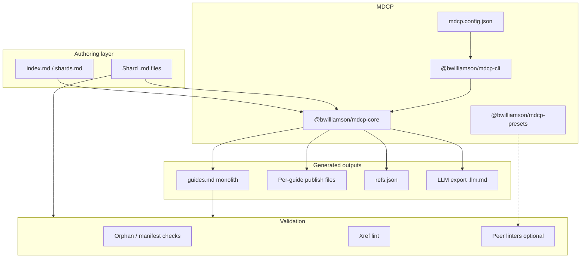

# Overview

**mdcp** (Markdown Command Line Interface Processor) is a docs-as-code pipeline for repositories where documentation is **authored in small shard files**, **compiled into canonical outputs**, and **validated before merge**. It is designed for teams that use LLMs to draft shards, humans to review them, and compiled monoliths for agents and end-user readers.

This page is the **mental model** for the whole system. Use it to orient yourself before diving into command details, API modules, or config fields.

## What problem it solves

Large Markdown guides are hard to edit, diff, and link correctly. A single `README.md` or `guides.md` with dozens of headings invites merge conflicts, broken cross-references, and orphan sections that no longer appear in the table of contents.

MDCP inverts the workflow:

1. **Authors edit shards** — one file per section, listed in the guide manifest (`index.md` or `shards.md`).
2. **Compile stitches shards** — heading levels are normalized, preambles stripped, links rewritten.
3. **Validation catches drift** — orphans, stale refs, bare cross-references, optional prose/style linters.
4. **Export serves consumers** — full monolith for humans, token-stripped output for LLM context.

You never hand-maintain the compiled file. Shards are the source of truth; `guides.md` (or a publish target like `README.md`) is generated.

## Core vocabulary

| Term               | Meaning                                                                                                              |
| ------------------ | -------------------------------------------------------------------------------------------------------------------- |
| **Shard**          | A single `.md` file that becomes part of a guide (for example `01-intro.md`).                                        |
| **Guide**          | A directory of shards plus a manifest (`index.md` or `shards.md`). Named in `compileOrder`.                          |
| **Monolith**       | Optional stitched output when top-level `outputFile` is set — combines guides without explicit `compile.outputFile`. |
| **Publish output** | Per-guide compiled file via `compile.outputFile` (or default `{name}.md` under `outputDir`).                         |
| **Refs registry**  | `.caches/refs.json` by default — GitHub-style slugs from compiled headings.                                          |
| **`--docs-root`**  | Root of guide shard directories (one subfolder = one guide).                                                         |
| **`outputDir`**    | Generated output root (default `_build`) — safe to delete. All generated paths are relative here unless absolute.    |
| **`--config`**     | Config file path, resolved relative to the **invocation** directory (where you run the command), not `--docs-root`.  |

### Path resolution (`--config` vs `--docs-root`)

```bash
mdcp compile --config docs/mdcp.config.json --docs-root docs
```

| Path                                 | Base          | Resolves to (example)                 |
| ------------------------------------ | ------------- | ------------------------------------- |
| `--config docs/mdcp.config.json`     | Invocation    | `/repo/docs/mdcp.config.json`         |
| Guide `features/`                    | `--docs-root` | `/repo/docs/features/`                |
| `outputDir: "_build"` (default)      | `--docs-root` | `/repo/docs/_build/`                  |
| Default per-guide output             | `outputDir`   | `/repo/docs/_build/features.md`       |
| `refs.registryFile` (default)        | `outputDir`   | `/repo/docs/_build/.caches/refs.json` |
| `compile.outputFile: "../README.md"` | `outputDir`   | publish path from `_build`            |

Consumer details: [Config essentials](../client-cli/config-essentials.md). API: `loadConfig(path, configBase)` uses the same `configBase` rule as the CLI.

## How the pieces fit together



| Package                         | Role                                                                                           |
| ------------------------------- | ---------------------------------------------------------------------------------------------- |
| **`@bwilliamson/mdcp-cli`**     | Command-line entry point: `compile`, `check`, `shard`, `refs`, `export`, peer linter wrappers. |
| **`@bwilliamson/mdcp-core`**    | Library implementation: compile/assemble, refs, validation, shard orchestration, hooks.        |
| **`@bwilliamson/mdcp-presets`** | Starter markdownlint configs for shard and compiled trees (not bundled; opt-in via config).    |

The CLI is a thin wrapper over core. Integrators (CI, editors, agents) can call core directly or shell out to the CLI.

## The pipeline in order

Understanding this sequence explains why most commands exist:

```text
  [optional] mdcp shard          Split a monolith into guide shards (md-tree)
           ↓
  Edit shards + index.md
           ↓
  mdcp compile                 Assemble monolith + publish outputs; rewrite links
           ↓
  mdcp refs generate           Write refs.json from compiled headings
           ↓
  mdcp check                   Orphans → compile → refs → xrefs → optional linters
           ↓
  mdcp export --llm            Token-stripped context for agents (optional)
```

**Split** (`mdcp shard`) is the inverse path — used when bootstrapping shards from an existing monolith, not on every edit cycle.

## What compile actually does

For each guide in `compileOrder`, core:

1. **Reads section files** — from link order in the manifest (`index.md` / `shards.md`). See [Manifest compile order](./manifest-compile-order.md) when the manifest mixes preamble example links with a `## Sections` list (`compile.sectionsHeading`).
2. **Transforms each shard** — demotes headings to fit the guide level; strips `about-this-guide` preamble; runs named **compile hooks** (`stripAnchors`, `codeEvidence`, `inlineInserts`, `reviewLinks`, …).
3. **Assembles the guide body** — injects optional `compile.title` as a `##` heading followed by a blank line, then concatenates sections in order. When the first shard’s top heading matches the title, that duplicate heading is stripped.
4. **Rewrites links** — same-guide `./section.md` → in-document `#anchor`; optional `publishPathRewrite` for repo-root paths on publish outputs.
5. **Writes outputs** — monolith file and/or per-guide `compile.outputFile`.

Guides with `compile.outputFile` are **excluded from the monolith** so you can publish npm READMEs, `DEVELOPERS.md`, or review monoliths side by side.

## What validation checks

`mdcp check` runs a fixed core pipeline, then optional peer tools:

| Stage   | Module                  | Catches                                        |
| ------- | ----------------------- | ---------------------------------------------- |
| Orphans | `validate/orphans.ts`   | Shard/manifest mismatches                      |
| Compile | `compile/`              | Assembly failures                              |
| Refs    | `refs/registry.ts`      | Stale `refs.json`                              |
| Xrefs   | `xrefs/lint.ts`         | Unlinked chapter-style references              |
| Linters | `peers/` + host install | markdownlint, Vale, link-check when configured |

Peer linters are **not bundled**. CI uses `--require-lint` / `--require-vale` to fail when tools are missing.

## Config as the wiring layer

`mdcp.config.json` is the single contract between your repo layout and every command:

- **`compileOrder`** — which guides exist and in what order they appear in the monolith.
- **`guides[].compile`** — per-guide manifest name, hooks, publish path, title, scope root, etc.
- **`refs`** — `registryFile` and monolith `outputFile` paths (relative to `outputDir`) and slug algorithm.
- **`lint` / `vale`** — peer linter config paths and scan globs.
- **`export.llm`** — what to strip for agent context.

This repository dogfoods under `docs/`: the features guide compiles into `docs/_build/guides.md`; developer, CLI, and core guides publish to `DEVELOPERS.md` and package READMEs. See `docs/mdcp.config.json` for a multi-output layout.

## Code map (where to read implementation)

| Concern                         | Core path                   | CLI command                     |
| ------------------------------- | --------------------------- | ------------------------------- |
| Config load / path resolution   | `src/config/`               | all commands                    |
| Section list + assemble + write | `src/compile/assemble.ts`   | `compile`                       |
| Per-shard hooks                 | `src/compile/hooks/`        | (config-driven)                 |
| Shard split orchestration       | `src/shard/orchestrator.ts` | `shard`                         |
| Slugs + refs registry           | `src/refs/`                 | `refs`                          |
| Orphan validation               | `src/validate/orphans.ts`   | `check`                         |
| Xref lint                       | `src/xrefs/lint.ts`         | `check`                         |
| LLM export                      | `src/export/llm.ts`         | `export --llm`                  |
| Peer binary resolution          | `src/peers/resolve.ts`      | `lint`, `prose`, `links`, `fix` |

Start with `assemble.ts` and `cli.ts` if you are tracing a compile from config to disk.

## Typical workflows

### LLM authoring a new section

Edit a shard (and `index.md` if section membership changed) → `mdcp refs lookup "topic"` while writing links → `mdcp check`.

### Human PR review

`mdcp check --require-lint` in CI; optional `mdcp prose` locally.

### Agent reading repo docs

`mdcp export --llm --stdout` or read the compiled monolith; `mdcp refs lookup` for stable anchor targets.

### Publishing package README from shards

Set `guides[].compile.outputFile` to the README path; run `mdcp compile`; README is generated, not hand-edited.

## Design boundaries (intentional limits)

- **GFM only** — [GitHub Flavored Markdown](../glossary/index.md#gfm); no Pandoc, wikilinks, or required `{#heading-ids}`.
- **md-tree for split only** — custom compile/assemble; upstream md-tree `assemble` is not used.
- **GitHub slugs** — computed from compiled headings, not from author-supplied IDs.
- **Peer linters opt-in** — host repo installs markdownlint, Vale, etc.
- **No preprocessor / templating** — variable substitution, template engines, and macro includes are consumer-repo pipeline stages outside MDCP (`preprocess → mdcp → postprocess`).

Details: [Design constraints](./design-constraints.md).

## Where to go next

- **Commands and priority tiers** — [Feature catalog](./feature-catalog.md), [Personas and priority tiers](./personas-and-priority-tiers.md)
- **Install and daily commands** — [Client CLI guide](../client-cli/index.md)
- **Programmatic API** — [Client core guide](../client-core/index.md)
- **Config fields** — [API — Config](../client-core/api-config.md)
- **Compile hooks** — [Compile hooks overview](../client-core/compile-hooks/index.md)
- **Contributing to this repo** — [Developer guide](../developer/index.md)
- **Migrating from legacy scripts** — [Legacy migration](./legacy-migration.md)
