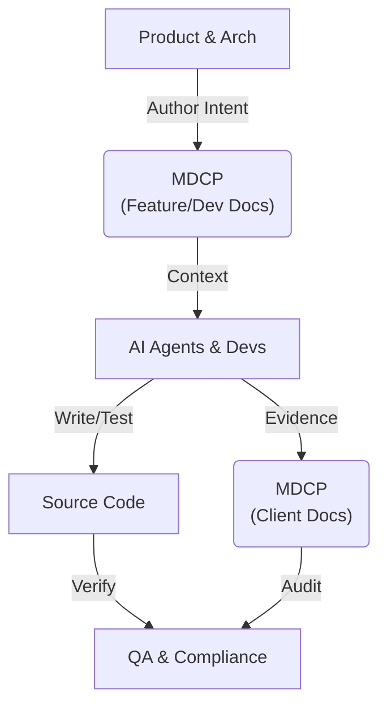
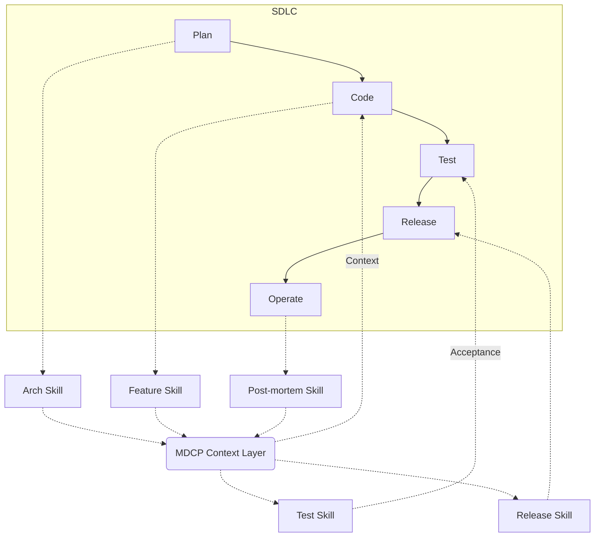

## The 30,000-Foot View: MDCP in the Value Stream

Where does MDCP sit in the software development value stream? It forms a persistent, machine-readable **Context Layer**.

The actors interact with the MDCP context layer to author intent, provide context, and generate evidence.

---

## MDCP Across the SDLC

While the previous diagram highlights _who_ interacts with MDCP, this view shows _where_ it sits in the traditional SDLC.

Instead of documentation being a disconnected artifact, MDCP acts as a continuous, bidirectional context layer.

---

## SDLC Agent Skills at a Glance

| Phase       | Agent Skill         | Action                                            |
| ----------- | ------------------- | ------------------------------------------------- |
| **Plan**    | `arch skill`        | Draft architecture docs                           |
| **Code**    | `feature skill`     | Ensure high-level and dev docs exist              |
| **Test**    | `test skill`        | Capture client-side and dev-side intent           |
| **Release** | `release skill`     | Ensure support docs are available and relevant    |
| **Operate** | `post-mortem skill` | Distill tickets and post-mortems back into shards |

---

## What MDCP Replaces

To understand where to pull MDCP in, we must be clear on its boundaries.

- Fragmented, quickly-outdated Wiki pages.
- Stale `README.md` files that no one trusts.
- Scattered Architecture Decision Records (ADRs).
- Undocumented "tribal knowledge."

---

## What MDCP Isn't

- **Not a Jira alternative:** It doesn't track task states or agile sprints.
- **Not active system monitoring:** It doesn't tell you if the server is down.
- **Not a rigid documentation silo:** It lives _in_ the repository alongside the code.

---
