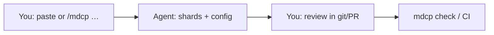
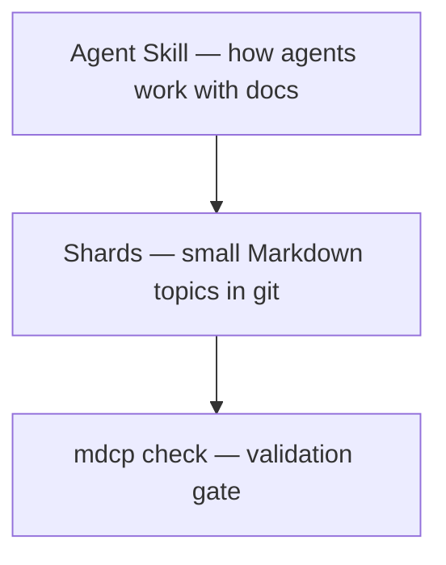

# MDCP 101

[MDCP](../glossary/mdcp.md) is a **human + AI documentation habit** for technical work: you and your agent keep durable intent in small Markdown files in git, instead of only in chat history.

## The problem

Agents forget. Chat threads disappear. Giant READMEs and dump files overwhelm both humans and model context. Next week's session cannot reliably reuse yesterday's decisions.

## How you work together

1. **You** decide what must stay true (product intent, constraints, glossary).
2. **The agent** drafts or updates small **[shards](../features/overview.md)** (one topic per file) _before_ coding.
3. **You** review those shards in pull requests (PRs) — you do not need to be a Markdown expert on day one.
4. **`mdcp check`** (locally or in CI) proves links and compile still work.

### Prompt loop



**In an [Agent Skills](https://agentskills.io) host** (Cursor, Claude Code, Copilot with skills, and similar):

```text
/mdcp help me get started
```

Or paste that line after installing the skill (`npx skills add betsalel-williamson/mdcp --skill mdcp` via the [`skills` CLI](https://www.skills.sh/docs/cli) — see [Get started](./get-started.md)).

**In a chat-only tool** (ChatGPT, Gemini web, no repo agent): do **not** install the toolchain yet. Keep notes in your project folder if you have one, or wait until you use an agent that can [edit a git repo](https://github.com/git-guides). Read [Overview](../features/overview.md) and [Vision and roadmap](../features/protocol/00-vision-and-roadmap.md) first.

**Automation / CI:** the [Agent Skill](../features/agent-skill.md) tells agents _when_ to touch docs; the [CLI](../client-cli/index.md) runs `compile` / `check` in scripts and pipelines ([The Toolchain](./the-toolchain.md)).

## Are you ready?

| Scenario                                          | Ready?    |
| ------------------------------------------------- | --------- |
| Git repo + an agent that can edit files           | Start now |
| Docs or decisions already sprawling (or about to) | Start now |
| Willing to review doc changes, not only code      | Start now |
| Chat-only coding with no project folder           | Wait      |
| One-off toy you will not reopen                   | Wait      |
| No interest in durable docs beyond chat           | Wait      |

You feel the benefit on the **second session** — when prior decisions are still findable — not on the first install.

## What's in the box



- **[Skill](../glossary/skill.md)** — instructions your agent follows (`/mdcp`, helpers).
- **[Shards](../features/overview.md)** — source of truth; compiled READMEs are generated — do not hand-edit them.
- **[Check](../client-cli/index.md)** — keeps the docs system honest as it grows.

Deeper model: [Overview](../features/overview.md). Install path: [Get started](./get-started.md).
