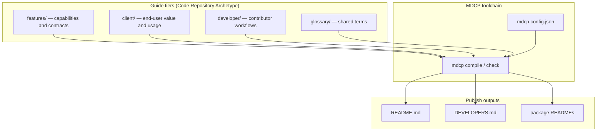
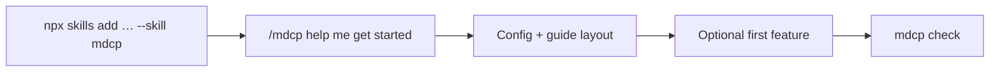
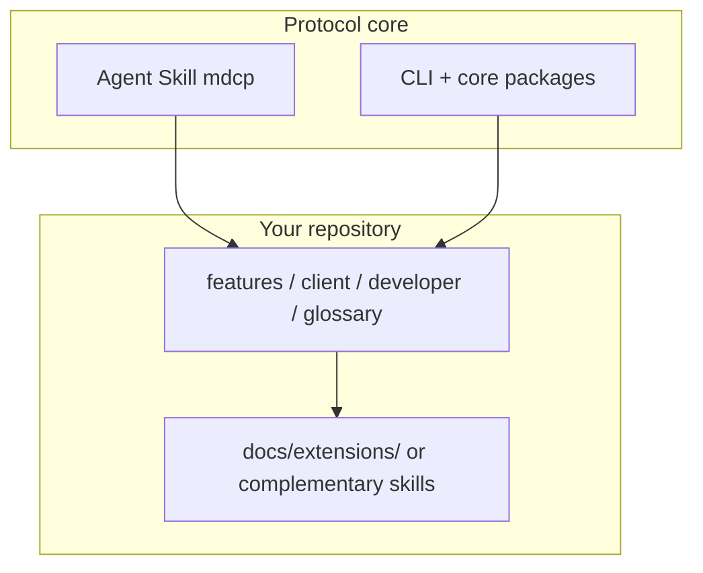
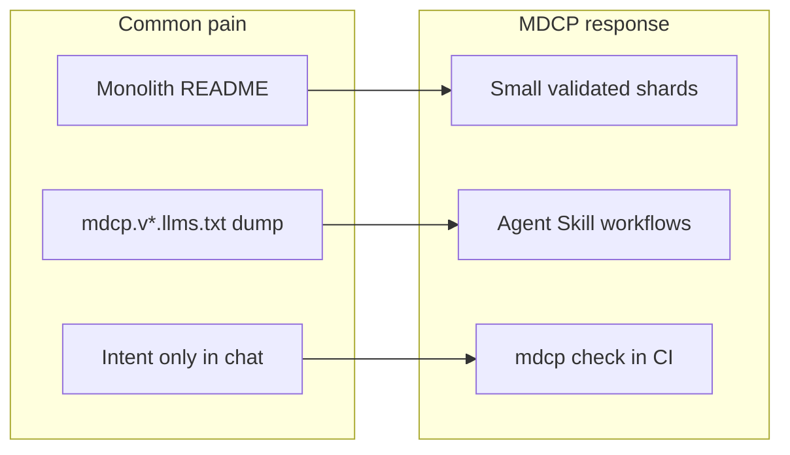

# MDCP 101

A five-minute mental model for first-time adopters. Edit **shards** (small Markdown files), compile them into publish outputs, and validate with `mdcp check` — never hand-edit generated READMEs. For the full model, see [Overview](../features/overview.md).

## Sharded structure

Language-agnostic shards sit in audience tiers. Compile stitches them into the outputs readers and agents consume.

## Init workflow

Bootstrap the Agent Skill, then let `/mdcp` wire the docs tree before your first feature.

## Extensions layer

Keep the portable skill generic. Put project-specific guidance in repo shards or extensions — do not hand-edit vendored skill files.

## Problems and solutions

