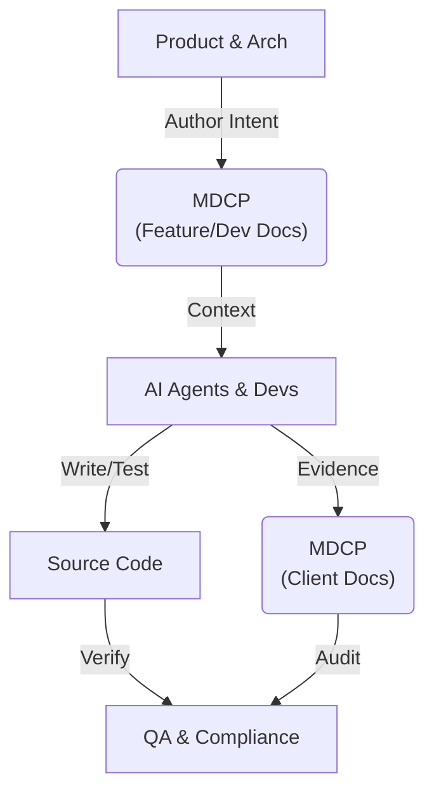
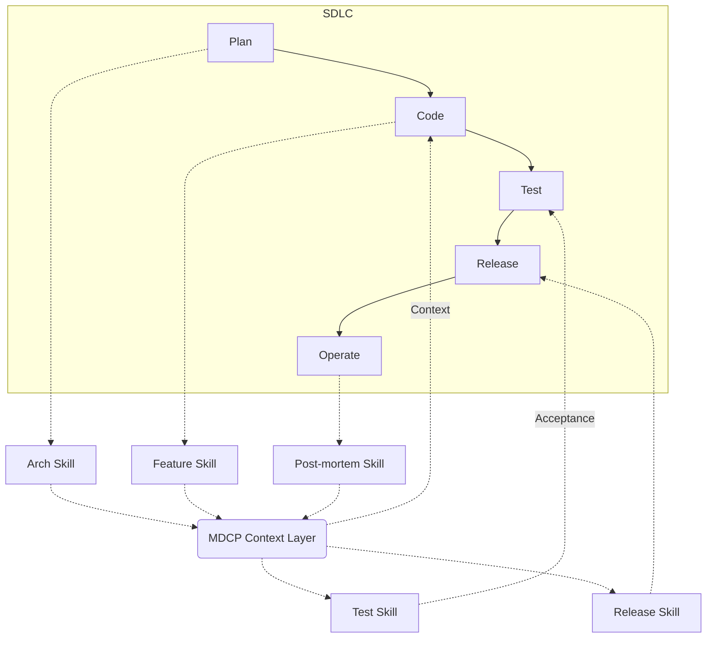

<!-- AUTO-GENERATED by mdcp — edit shards, then run: mdcp compile -->

<!-- mdcp-shard: start ../docs/presentation-la-devops/00-intro.md -->

---

theme: default
---

## Intent is the New Syntax

### Introducing the MarkDown Context Protocol (MDCP)

**LA DevOps Community**
**July 30, 2026**
[LA DevOps Meetup Group](https://www.meetup.com/meetup-group-zzqwjltm/)

---

### About Me: Betsalel (Saul) Williamson

- **Co-founder and COO, Bitstream Labs, Inc.**
  - Accelerating AI deployments on FPGAs
- **Mission-Critical Operations**
  - Lead DevOps Engineer for lunar logistics at Astrobotic
  - U.S. Navy Nuclear Program (BPMI)
- **Community Leadership**
  - DORA Community Guide
  - LGBT+ and disability advocate

---

### The Journey

- From mission-critical aerospace to fast-moving AI startups.
- The zero-fail mindset of the nuclear program applied to software engineering.

---

### The Core Thesis

**"Intent is the New Syntax."**

As AI accelerates code generation, capturing _why_ we build is more critical than _how_ we build.

---

### The Payoff

Documenting intent is hard, real work. MDCP won’t do it for you.

Tonight, we'll look at an **Agent Skill** that makes this work pay off permanently:
**Writing docs _once_ that serve both your team and your AI agents** — by putting small, durable shards where long-term system value lives.

---

<!-- mdcp-shard: end ../docs/presentation-la-devops/00-intro.md -->

<!-- mdcp-shard: start ../docs/presentation-la-devops/01-problem-and-pain.md -->

### The Problem: $2.4T Cost of Software Failures

- **$2.41 trillion** total cost of poor software quality in the US (2022).
- **~$1.8 trillion** from operational software failures.
- **$1.52 trillion** in rapidly accumulating technical debt.

_Source: [CISQ 2022 CPSQ Report](https://www.it-cisq.org/wp-content/uploads/sites/6/2022/11/CPSQ-Report-Nov-22-2.pdf)_

---

### The Root Cause: "Documentation Debt"

As defined by [IBM](https://community.ibm.com/community/user/blogs/frank-de-gilio/2026/05/28/the-repository-knows-why), documentation debt happens when requirements fail to match what was actually built.

When problems are solved in code but never make it back to the PRD, we lose **traceability** and **intent**.

---

### The Trillion-Dollar Graveyard

- **Lost Context:** Invisible solutions to unknown problems become load-bearing features.
- **The AI Amplifier:** AI generation increased duplicate code 8x while healthy refactoring dropped below 10%. _([GitClear 2024/2025](https://gitclear-public.s3.us-west-2.amazonaws.com/GitClear-AI-Copilot-Code-Quality-2025.pdf))_
- **The Verification Tax:** Reviewing AI code is creating massive bottlenecks. AI just generates legacy technical debt at scale. _([DORA 2026](https://www.infoq.com/news/2026/05/dora-roi-ai-assisted-dev-report/))_

---

### Context Overload

- Large documentation dumps (monolithic READMEs, site-wide `llms.txt`) pollute agent reasoning.
- Massive context dumps increase latency, drive up inference costs, and trigger hallucinations.
- Teams lack a shared, reviewable contract for **what documentation means**.

---

### The Adversarial Reality

We have known documentation is the problem for decades, yet we rarely fix it. Why?

- **Working code sells:** Demos and MVPs win deals. Docs are usually only valued during failures.
- **Docs are viewed as a chore:** Engineers often see documentation as a duplication of work.
- **The "Look at the Code" Fallacy:** "Want to know what the system does? Look at the code."

---

### Why "Look at the Code" Fails

- The business and users don't have access to the code.
- New engineers lack the context to understand _why_ one part links to another.
- Code doesn't explain why tests are stale, or capture the critical edge case from a Jira ticket.

---

<!-- mdcp-shard: end ../docs/presentation-la-devops/01-problem-and-pain.md -->

<!-- mdcp-shard: start ../docs/presentation-la-devops/01b-terminology.md -->

### Shared Language / Terminology

Before we dive in, a few terms we'll use throughout:

- **Shard:** A small, focused markdown file containing specific context (e.g., a single concept, persona, or architecture decision).
- **MCP (Model Context Protocol):** An open standard for AI assistants to access external data sources.
- **Agent Skill:** A specialized context file (e.g., `SKILL.md`) providing domain knowledge and behavioral instructions for the agent.
- **PRD:** Product Requirements Document.

---

<!-- mdcp-shard: end ../docs/presentation-la-devops/01b-terminology.md -->

<!-- mdcp-shard: start ../docs/presentation-la-devops/02-alternate-vision.md -->

### The Alternate Vision: MDCP

**MarkDown Context Protocol (MDCP)** is an **Agent Skill** and lightweight toolchain for **system context** in the repo.

- **A skill and method:** Helps you practice durable docs — not a magic bullet, and not an industry “standard” to join.
- **Small shards:** Distill mind maps, arch notes, specs, and product ideas into focused Markdown files.
- **Agent-friendly:** Agents pull **one section at a time** by reading a single shard — which keeps LLMs on track.
- **Long-term payoff:** Write intent once. It onboards humans, traces value for the system, and gives AIs the same contract.

---

### Why Will MDCP Actually Work?

If we just demand more docs, aren't we just shifting the burden?

MDCP is a tool that enables people to **think more clearly**.

It flips the script: documentation becomes the _fun part_ of the design process, not a post-hoc chore. Small chunks help people see the root of an idea — and help agents stay aligned with that root.

---

### The RISC vs CISC Argument for Codebases

In the age of LLMs, our greatest risk is creating systems "too complicated" to understand.

- **CISC (Complex Instruction Set):** Monolithic, tangled logic. You must understand the whole to understand the parts.
- **RISC (Reduced Instruction Set):** MDCP takes the RISC approach. We break the system into small, digestible, composable components (shards).

Because each part is understandable, the entire system can be reasoned about.

---

### Cross-Functional Collaboration

Works for a **team of one** or a full product, engineering, and marketing org — bring everyone to the front of the line:

- Product Managers (defining the "why")
- FinOps
- Technical Writers (wrangling the "how")
- System Architects
- QA Engineers & Support Staff
- Marketing (clear value and learnability)

**MDCP restores a healthy, collaborative engineering culture.**

---

<!-- mdcp-shard: end ../docs/presentation-la-devops/02-alternate-vision.md -->

<!-- mdcp-shard: start ../docs/presentation-la-devops/02b-personas.md -->

### Who is MDCP For? (The Personas)

MDCP supports a team of one **or** the entire software value chain:

- **Planning:** You write the shards to ensure intent is clear before implementation.
- **Developers:** You get context to verify behavior and understand design constraints.
- **Quality:** You review the intent to ensure we aren't overlooking blind spots.
- **Compliance:** You know exactly what to look for to ensure policies are met.
- **Operators:** You know how to use the system effectively.
- **Product & marketing:** You keep learnable value and WIIFM aligned with what shipped.
- **Feedback Loop:** Real use comments and lessons learned are recorded back to the docs.

---

<!-- mdcp-shard: end ../docs/presentation-la-devops/02b-personas.md -->

<!-- mdcp-shard: start ../docs/presentation-la-devops/02c-value-chain.md -->

<style scoped>
.columns {
  display: grid;
  grid-template-columns: 1fr 1fr;
  gap: 1rem;
  align-items: center;
}
.columns img {
  width: 100%;
  height: auto;
  max-height: 500px;
  object-fit: contain;
}
</style>

<div class="columns">
<div>

### The 30,000-Foot View: MDCP in the Value Stream

Where does MDCP sit in the software development value stream? It forms a persistent, machine-readable **Context Layer**.

The actors interact with the MDCP context layer to author intent, provide context, and generate evidence.

</div>
<div>



</div>
</div>

---

<style scoped>
.columns {
  display: grid;
  grid-template-columns: 1fr 1fr;
  gap: 1rem;
  align-items: center;
}
.columns img {
  width: 100%;
  height: auto;
  max-height: 500px;
  object-fit: contain;
}
</style>

<div class="columns">
<div>

### MDCP Across the SDLC

While the previous diagram highlights _who_ interacts with MDCP, this view shows _where_ it sits in the traditional SDLC.

Instead of documentation being a disconnected artifact, MDCP acts as a continuous, bidirectional context layer.

</div>
<div>



</div>
</div>

---

### SDLC Agent Skills at a Glance

| Phase       | Agent Skill         | Action                                            |
| ----------- | ------------------- | ------------------------------------------------- |
| **Plan**    | `arch skill`        | Draft architecture docs                           |
| **Code**    | `feature skill`     | Ensure high-level and dev docs exist              |
| **Test**    | `test skill`        | Capture client-side and dev-side intent           |
| **Release** | `release skill`     | Ensure support docs are available and relevant    |
| **Operate** | `post-mortem skill` | Distill tickets and post-mortems back into shards |

---

### What MDCP Replaces

To understand where to pull MDCP in, we must be clear on its boundaries.

- Fragmented, quickly-outdated Wiki pages.
- Stale `README.md` files that no one trusts.
- Scattered Architecture Decision Records (ADRs).
- Undocumented "tribal knowledge."

---

### What MDCP Isn't

- **Not a Jira alternative:** It doesn't track task states or agile sprints.
- **Not active system monitoring:** It doesn't tell you if the server is down.
- **Not a rigid documentation silo:** It lives _in_ the repository alongside the code.

---

<!-- mdcp-shard: end ../docs/presentation-la-devops/02c-value-chain.md -->

<!-- mdcp-shard: start ../docs/presentation-la-devops/02d-dora-capabilities.md -->

### MDCP & The DORA AI Capabilities Model

The [DORA AI Capabilities Model](https://dora.dev/ai/) demonstrates that AI adoption alone isn't enough.

It must be multiplied by key organizational practices to drive real performance.

MDCP directly enables these critical multipliers.

---

### DORA Multipliers Enabled by MDCP

- **AI-accessible internal data:** MDCP _is_ the structured context layer, turning tribal knowledge into machine-readable shards.
- **Strong version control practices:** MDCP lives in the repository, version-controlled alongside the code it describes.
- **User-centric focus:** MDCP provides the framework to explicitly capture _Personas_ and _Intent_ before implementation begins.

---

### DORA Multipliers Enabled by MDCP (Cont.)

- **Clear + communicated AI stance:** MDCP gives agents a shared, reviewable contract for how to read and update system context — without pretending to be an industry standard.
- **Healthy data ecosystems:** Granular, validated shards prevent AI hallucinations and context overload.

---

<!-- mdcp-shard: end ../docs/presentation-la-devops/02d-dora-capabilities.md -->

<!-- mdcp-shard: start ../docs/presentation-la-devops/03-policies-to-achieve-vision.md -->

### Policies to Achieve the Vision

The bottleneck is no longer code syntax. It's our ability to accurately architect systems.

Your docs must capture:

1. **Intent and Value:** Why does this exist?
2. **User Personas:** Who is suffering without this?
3. **System Realities:** Is this a greenfield prototype, or a 30-year-old legacy system?

---

### Core MDCP Principles

- **Capture to the Proper Degree:** A method to ensure info supports all value chain activities.
- **High level over implementation:** Shards hold plan, constraints, and acceptance criteria; code holds _how_.
- **Glossary as first-class:** Domain terms and legacy disambiguation live in dedicated shards.
- **Document before build/migrate:** Capture context in shards before greenfield work.
- **Granular, safe context:** Read one shard at a time; skip monolith dumps.
- **Extensible doc skill:** MDCP is the foundational “go-to” documentation skill. Teams can extend it locally (e.g., `docs/extensions/`) to integrate custom workflows and proprietary systems.

---

<!-- mdcp-shard: end ../docs/presentation-la-devops/03-policies-to-achieve-vision.md -->

<!-- mdcp-shard: start ../docs/presentation-la-devops/04-plan-to-enact.md -->

### Plan to Enact: Phased Delivery

- **V1: Authoring**
  - Agent Skills bootstrap
  - Agent tasks & skills
  - `mdcp compile` and validation
- **V2: Delivery (MCP Adapter)**
  - MDCP MCP server (shard read, glossary search)
- **V3: Hosted Context API**
  - OpenAPI spec, API keys, polyglot clients

---

### Getting Started: Agent Skills

Install the MDCP Agent Skill in your repo (`.agents/skills/mdcp/SKILL.md`):

```bash
npx skills add betsalel-williamson/mdcp --skill mdcp
```

- It's a **behavioral guide**, not a context dump.
- Tells agents how to compile, validate, and read shards one at a time.

Or use the CLI init to scaffold your docs:

```bash
npx @bwilliamson/mdcp-cli init --docs-root docs
mdcp compile --config docs/mdcp.config.json
```

---

### The 5-Minute Starting Point

This isn't a magic bullet that instantly understands your legacy codebase. It's a frictionless, 5-minute starting point that puts docs in the right place so they scale.

- Open **Cursor** (or any LLM tool) in a repo.
- Install the skill, then type: `/mdcp help me get started`
- The agent reads `.agents/skills/mdcp/SKILL.md` and the getting-started subagent.
- Watch it set up your documentation shards and capture intent _before_ writing code.

---

<!-- mdcp-shard: end ../docs/presentation-la-devops/04-plan-to-enact.md -->

<!-- mdcp-shard: start ../docs/presentation-la-devops/05-call-to-action.md -->

### Call to Action

Let’s ensure the future of agentic coding isn’t just generated faster—it’s designed with intent.

1. **Shape the practice:** Become a founding adopter — try the skill on a real repo and tell us what breaks.
2. **Kick the tires:** Install the agent skill:
   `npx skills add betsalel-williamson/mdcp --skill mdcp`
3. **Show support:** Drop a ⭐ on the GitHub repo.
4. **Spread the word:** Share with solo builders and cross-functional teams alike.

---

### Thank You

**Questions? Demo?**

- **GitHub:** `betsalel-williamson/mdcp`

_Appendix slides follow for common objections during Q&A._

---

<!-- mdcp-shard: end ../docs/presentation-la-devops/05-call-to-action.md -->

<!-- mdcp-shard: start ../docs/presentation-la-devops/04b-faq.md -->

### Appendix: FAQ — What MDCP is NOT

Common objections for Q&A — skip during the main talk:

1. **Why not store project plans, tickets, or Cursor plans in the repo?**
2. **Why yet another doc tool? Aren't there a million already?**
3. **How does this integrate with my existing doc tools?**
4. **How does MDCP ensure the code built matches the docs?**

---

### Why not store project plans or tickets in the repo?

- MDCP holds **hard, durable system context** — intent, architecture, terminology.
- Tickets and spikes capture what happened — but future readers need the **outcome**, not the incident log.
- Distill learnings into shards: new constraints, updated personas, why the system changed.
- The **story** lives in Jira/Linear. The **durable result** lives in the repo.

---

### Why yet another doc tool?

- We're not replacing Docusaurus, MkDocs, or CI doc generators.
- MDCP is an **Agent Skill** (plus compile/check tooling) that organizes **documentation context** the way OpenAPI organizes API contracts — as a useful analogy, not a standards-body claim.
- Doc sites weren't built for granular, PR-reviewable, agent-first **shard** workflows.
- The missing piece is a **shared, validated place** for intent that agents and humans consume the same way — so docs scale without becoming monolith dumps.

---

### How does this integrate with my existing doc tools?

- **Integration, not replacement:** MDCP works alongside Docusaurus, MkDocs, Confluence exports.
- Shards are the source of truth. If you need monolithic files, `mdcp compile` generates them.
- **Why try it?** Docs that work for humans often fail agents (context dumps, conflicting terms).
- MDCP gives agents a **validated, granular contract** without throwing away your existing toolchain.

---

### How does MDCP ensure the code built matches the docs?

- It doesn't magically force compliance — it is not a magic bullet.
- By making docs granular, machine-readable, and co-located with code, it helps people and AI agents continuously verify implementation against intent.
- It makes documentation the _blueprint_ for LLM code generation, rather than an afterthought — when someone uses the skill productively.

---

<!-- mdcp-shard: end ../docs/presentation-la-devops/04b-faq.md -->
