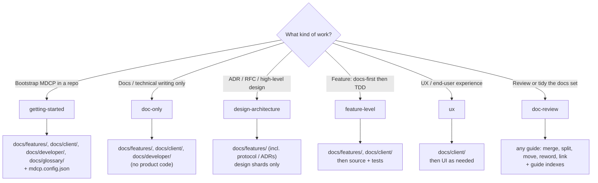

# MDCP

Host-agnostic **documentation system** Agent Skill for MDCP. Prefer this over
IDE extensions when you want durable, sharded docs that agents and humans can
maintain as ideas keep coming.

This is the only skill a project installs. It chooses a workflow for the task in
front of it (see [Pick the workflow](#5-pick-the-workflow)) and loads just that
workflow's file. Complementary archetype skills can extend it for specific
documentation architectures.

Install help: [references/install.md](references/install.md).
What compile / check / refs mean and CLI commands:
[references/cli-and-scripts.md](references/cli-and-scripts.md).

## Hard rules

- **NEVER** invent MDCP workflow when this skill already defines it — follow the skill first.
- **NEVER** hand-edit files in a vendor-managed install under your agent’s skills
  directory (for example `.agents/skills/` in Cursor/Amp) for repo-specific
  guidance — use complementary skills, `docs/extensions/`, or normative shards.
- **NEVER** edit generated compile output (`docs/_build/`, compiled publish
  targets) — fix shards and recompile.
- **NEVER** dump whole monoliths into context — discover with host search (`rg`,
  IDE search), then read **one shard** at a time.
- **NEVER** write functional product code for a docs/feature change without
  docs-first shards when the repo follows that convention.
- **ALWAYS** run `mdcp check` (or `docs:check`) before trusting compiled output.

## When nobody can answer

The workflows below ask intake questions and show a plan before editing. The
user may not be watching and may not be able to answer mid-task (a headless
or scheduled run, or a request that already says what to do). Asking and then
stopping there leaves the work undone, so:

- Take every value you can from the request and the repo. `WORK_ITEM` is the
  request itself; `WORK_ITEM_LOOKUP` defaults to
  `docs/developer/agent-work-item-tracking.md` or the nearest equivalent.
- For anything still missing, pick the reasonable default and state it in one
  line.
- Put the plan, with its commit groups, in your reply, then carry on with the
  edits. Edits on a branch are reversible.
- Stop and wait only when the user asked for a plan first, or before a
  destructive or irreversible step, a real change of scope, or input only the
  user can give.

## Requested layouts that break the rules

Requests often come with a document layout attached, such as one file for
everything, a legacy doc extended in place, old notes kept for history, code
added to make a design concrete, or every copy of a rule patched by hand. That
layout usually comes from time pressure rather than a decision about the docs,
and following it literally recreates the drift MDCP exists to prevent. Serve
the goal behind the request and keep the structure:

| Request                                 | Do this, and say so in your reply                                                                  |
| --------------------------------------- | -------------------------------------------------------------------------------------------------- |
| One file, so there is one thing to read | Focused shards and an ADR per decision; the guide index or a short overview is the one entry point |
| Growing a legacy monolith in place      | Move its content into shards and ADRs; leave the monolith as a stub that links to them             |
| Keeping backlogs or old notes           | Drop them from durable docs; the tracker and git history keep them                                 |
| Code to make a design concrete          | Contracts in prose and tables; how it is built stays in code                                       |
| Changing every copy of a rule           | Change it in the one shard that states it and link to that shard from the others                   |
| Work outside this workflow's scope      | Leave it, and say which workflow covers it                                                         |

Finish the work in this structure instead of stopping to argue for it. In your
reply, list each request you did not follow literally, with a one-line reason.

## Quality Assurance (QA) Principles

When applying MDCP, act as a complementary partner to other skills and systems.
These habits keep docs trustworthy while the product keeps changing:

- **Always reference doc shards:** Insert yourself into the process so the
  current task points at the correct documentation shards before work spreads.
- **Update as you go:** Continuously update documentation as work progresses so
  shards and code do not drift apart mid-change.
- **Small batches / one focused feature:** Prefer one shippable slice per branch
  or session. Oversized requests produce tangled diffs and half-updated docs;
  split the request (and the shards) before coding so each change stays
  reviewable and documentation can stay current with it. Pair with **Atomic
  commit groups** below when the plan has more than one logical change.
- **Atomic commit groups:** Before waiting for human review / “go”, coding and
  multi-concern plans MUST include numbered commit groups. Each group:
  id/name, one concern, exact files, and the intended conventional commit
  subject. After approval: implement and `git commit` one group at a time; do
  not squash unrelated concerns into one commit. Why: reviewable diffs, one
  concern per commit, and it matches small batches.
- **Current docs only:** Shards must describe the product **as it works now**.
  When behavior or guidance changes, remove superseded or stale text from
  durable docs — do not leave “old way” sections for archaeology. Git history
  preserves prior wording; consumer notice of breaking or removed behavior
  belongs in the **changeset** (folded into package CHANGELOGs at release),
  not in feature/client/developer shards. Never link durable shards or ADRs to
  pending `.changeset/*.md` files — those notes are temporary.
- **Capture ambiguity:** Identify ambiguous terms or language and write the
  clarified details into specific shards.
- **Shard single responsibility:** Each durable shard has one primary concern,
  for one audience tier, serving one job (explain **or** instruct how-to **or**
  define/look up — not several). If you cannot state that responsibility in one
  sentence, split or narrow the shard before shipping it. Depth:
  [references/shard-responsibility.md](references/shard-responsibility.md).
- **Idea mitosis:** When a shard grows a second audience, job, or concern —
  or reading it alone misleads — **split** it, update the guide index, and
  cross-link. Do not split only because a file is long. Unsettled discovery
  and time-bound notes do not share a file with durable current truth.
- **Break it down:** Organize information into the smallest useful pieces
  (shards) so agents can load one shard at a time instead of drowning in
  monoliths. Prefer mitosis over mini-monoliths.
- **Two-level review:** Review each changed idea or shard **in isolation** for
  local correctness and single responsibility. Then review it
  **comprehensively** against related shards and guides — flag duplication,
  better splits/merges/relocations, and drift between what guides promise and
  what the change does. When a change touches a guide (a shard, a skill, or
  code whose behavior a guide documents), the review is complete only when the
  change and its guides agree.
- **No code in docs:** Put intent, contracts, and acceptance criteria in
  shards — not implementation. Code samples and internals drift; the codebase
  is the source of truth for how something is built. This matches
  **What belongs where** below.
- **No temp info or backlogs:** Do not record temporary project information,
  tickets, incident logs, or migration backlogs and planning in the durable
  documentation. That information belongs in issue tracking and project
  planning tools. Pending `.changeset/*.md` files are temporary release notes —
  write them for the release pipeline; do not link them from ADRs or other
  durable docs.
- **Record planning locations:** Record where planning documents and
  architectural decisions live so agents can find them without stuffing plans
  into durable product shards.

## What belongs where

Documentation is a **first-class artifact** alongside code. We use a **spec-driven** workflow: shards hold context, intent, and the high-level meta plan; **implementation details stay in code**.

The default MDCP structure acts as the "batteries-included" **Code Repository Archetype**. This fundamental four-tier taxonomy enforces strict boundaries to prevent the docs system from falling apart as it scales:

| Guide             | Holds                                                                                    | Does not hold                                                                 |
| ----------------- | ---------------------------------------------------------------------------------------- | ----------------------------------------------------------------------------- |
| `docs/features/`  | How the plumbing works — capabilities, design, contracts, acceptance criteria            | Maintainer runbooks, live eval suites, contributor setup, impl walkthroughs   |
| `docs/client/`    | How a specific persona finds value using the software — outcomes, flows, usage           | Internal architecture, skill-authoring, live evals, maintainer-only workflows |
| `docs/developer/` | How to work on the repo — setup, layout, validation, skill development, live skill evals | Product capability narrative or end-user tutorials                            |
| `docs/glossary/`  | Shared terms and disambiguation                                                          | General code snippets                                                         |

**Placement test:** If only contributors to this repo need the shard, put it in `docs/developer/`. If consumers of the product need it, use `docs/features/` or `docs/client/`. The same topic may span tiers (for example Agent Skill product delivery vs maintainer live evals). Placement is one axis of **shard single responsibility**; if consumer and contributor needs collide in one file, use idea mitosis.

_(Note: The MDCP engine itself is domain-agnostic. Non-code projects can define entirely different guide tiers/archetypes while still using the same compile and validation checks. Lineage for external frameworks: [references/acknowledgments.md](references/acknowledgments.md).)_

## Authoring rules

- Shards under `docs/**/` are the source of truth.
- Use `#` headings in shards; mdcp demotes them during compile.
- After changing a guide's link order (e.g., in `index.md`), run `mdcp compile` — there is no separate manifest sync step.
- After inserting `[text](#slug)` cross-links, run `mdcp check` so fragments match **compiled** slugs (use `mdcp refs list` if you need to inspect the registry).

## When to use

- **PROACTIVELY on ANY feature, bugfix, or architectural task:** MDCP must be involved in the entire process. Before writing code, trace the requirement back to documentation. Consider the end-user problems and ensure helpful docs exist or are created.
- Authoring or refactoring sharded markdown under a docs root
- Bootstrapping MDCP in a repository, or reviewing and reorganizing an existing docs set
- Cross-links / refs while writing docs
- Extending guidance via complementary skills or local `docs/extensions/` when needed

## Execution steps

### 1. Install or rediscover

```bash
npx skills add betsalel-williamson/mdcp --skill mdcp
```

### 2. Prefer smallest context

Discover the relevant shard with host search (`rg`, IDE search) or the guide
`index.md`, then open **one** `.md` shard. Broader compiled monolith reads are last
resort.

### 3. Edit shards, then validate

1. Edit shards under guides in `compileOrder`.
2. Update `index.md` / `shards.md` when adding files.
3. **Build** compiled docs from shards, then **validate** the docs tree
   (see [references/cli-and-scripts.md](references/cli-and-scripts.md) for what
   these mean):

```bash
mdcp compile
mdcp check
```

### 4. Code Formatting and Linting

If the user asks to set up formatting or linting, they should install `prettier`, `markdownlint-cli2`, and `@bwilliamson/mdcp-presets` via their package manager. (Note: MDCP is flexible; if the user prefers other formatting or linting tools, you can integrate those instead.)

To automatically format documents using the default tools:

```bash
mdcp fix
```

To run prose linting (requires Vale):

```bash
mdcp prose
```

### 5. Pick the workflow

Each kind of work has its own workflow file. Pick **one** for the current
`WORK_ITEM` (one focused batch per branch), read that file, and follow its
Process. Do not load the others.

| The task                                                            | Workflow                                                           |
| ------------------------------------------------------------------- | ------------------------------------------------------------------ |
| No `mdcp.config.json` yet, or the user asks to set up MDCP          | [getting-started](references/workflows/getting-started.md)         |
| Documentation only, no product code                                 | [doc-only](references/workflows/doc-only.md)                       |
| Architecture, RFC, or ADR before code exists                        | [design-architecture](references/workflows/design-architecture.md) |
| A feature or bugfix that changes product code                       | [feature-level](references/workflows/feature-level.md)             |
| End-user journeys, client guides, UI that serves them               | [ux](references/workflows/ux.md)                                   |
| Review, tidy, or reorganize docs; or a sprawl trigger below matches | [doc-review](references/workflows/doc-review.md)                   |

When a request spans several rows (for example "design it, build it, and write
the user guide"), take the first row that applies as this `WORK_ITEM`, say which
parts you are deferring, and name the workflow each one needs.



Hosts that can fork work (Task tool, `context: fork`, and similar) may run the
chosen workflow in an isolated agent; otherwise follow it in the main session.

### 6. Sprawl triggers

Docs sprawl gradually, and nobody notices until a reader gets lost. Do not wait
for the user to spot it. When any of these is true at the end of a workflow,
run `mdcp review` and, if it reports findings, offer the
[doc-review workflow](references/workflows/doc-review.md) as the next
`WORK_ITEM`:

- The session added three or more shards, or added a shard to a guide index that
  already had about a dozen entries.
- You wrote a rule or definition and found the same idea already stated in
  another shard.
- A shard you edited now serves a second audience or job.
- The change renamed, moved, or deleted a shard.

### 7. Weekly review routine (actively changing projects only)

Sprawl triggers catch what one session adds. In a project whose docs change
every week, small additions from many sessions still pile up between them. For
those projects, recommend a weekly routine. The user sets it up in whatever
scheduler their agent host or CI offers. Each run reviews every guide in
`compileOrder` separately:

1. `mdcp review --guide <name>` for the mechanical signals. Duplicates shared
   with other guides are included.
2. The [doc-review workflow](references/workflows/doc-review.md) with **SCOPE**
   set to that guide. Decide where each duplicated rule belongs, keep it there,
   and link to it from the other shards.

Recommend it only when docs or code changed in most weeks of the last month,
such as commits in at least three different weeks of
`git log --since="4 weeks ago" -- docs/`. For a one-off project or one that
changes now and then, say the routine is not needed. The sprawl triggers above
cover it.

## Zero-install

Copy the `mdcp` skill folder into the skills directory **your agent discovers**
(see [skills CLI Supported Agents](https://github.com/vercel-labs/skills#supported-agents)).
For example `.agents/skills/mdcp/` for Cursor/Amp project installs — not a
universal portable path.
